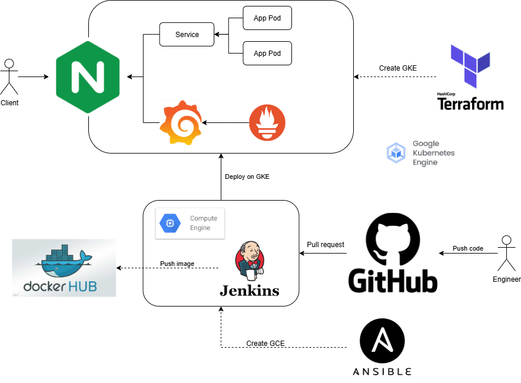
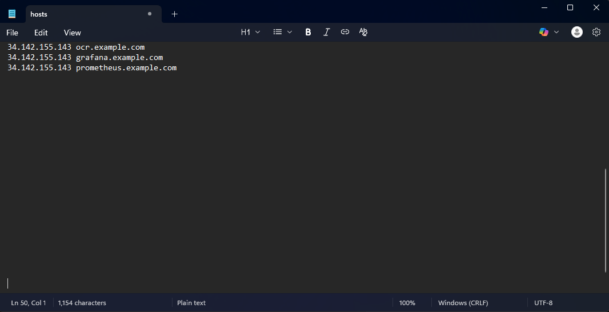
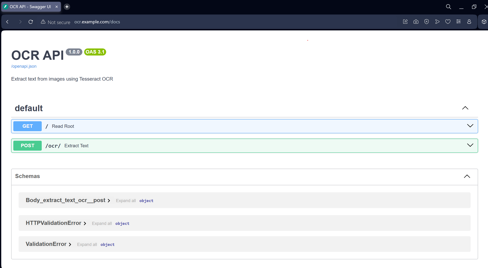
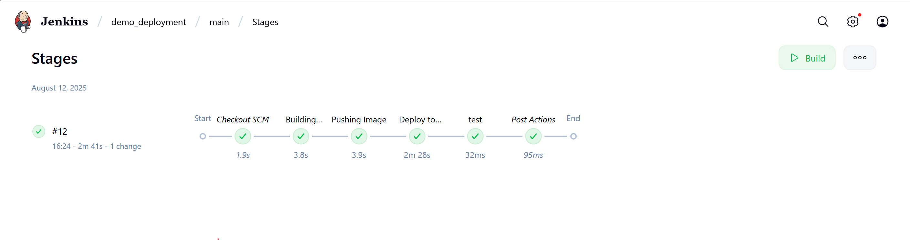
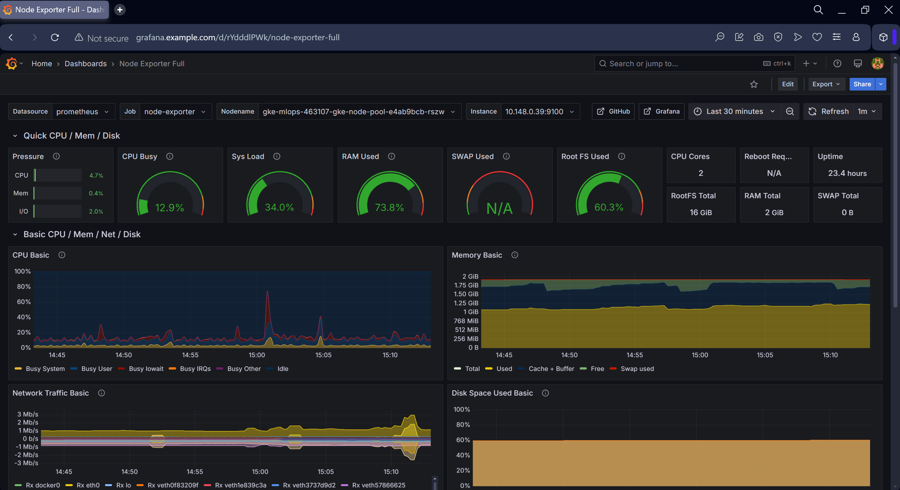

# MLOps Demo Deployment - OCR API

<div align="center">



*A comprehensive MLOps demo showcasing the deployment of an OCR (Optical Character Recognition) API using modern DevOps practices*

[](https://docker.com)
[](https://kubernetes.io)
[](https://jenkins.io)
[](https://fastapi.tiangolo.com)
[](https://terraform.io)

</div>

## 🚀 Project Overview

This project demonstrates a complete MLOps workflow for deploying a FastAPI-based OCR service that extracts text from images using Tesseract. The deployment includes:

- **FastAPI OCR Application**: REST API for text extraction from images
- **Docker Containerization**: Containerized application with proper dependencies
- **Kubernetes Deployment**: Helm charts for orchestration
- **CI/CD Pipeline**: Jenkins-based automated deployment
- **Infrastructure as Code**: Terraform and Ansible for infrastructure management
- **Ingress Controller**: Nginx ingress for external access

## 📁 Project Structure

```
demo_deployment/
├── 📁 app/                    # FastAPI OCR application
│   ├── main.py               # Main application code
│   ├── requirements.txt      # Python dependencies
│   └── Dockerfile           # Container configuration
├── 📁 cicd/                  # CI/CD configuration
│   ├── Jenkinsfile          # Jenkins pipeline
│   └── jenkins-admin-token.yaml  # GKE admin token for CI/CD
├── 📁 helm_charts/           # Kubernetes Helm charts
│   ├── model-deployment/    # OCR app deployment
│   └── nginx-ingress/       # Ingress controller
├── 📁 iac/                   # Infrastructure as Code
│   ├── terraform/           # Terraform configurations
│   └── ansible/             # Ansible playbooks
├── 📁 images/                # Project images and diagrams
├── 📁 example/               # Sample images for testing
└── Makefile                 # Build and deployment commands
```

## 🛠️ Prerequisites

- [Docker](https://docs.docker.com/get-docker/)
- [Kubernetes cluster](https://kubernetes.io/docs/setup/) (GKE, EKS, or local like Minikube)
- [Helm 3.x](https://helm.sh/docs/intro/install/)
- [Terraform](https://www.terraform.io/downloads)
- [Ansible](https://docs.ansible.com/ansible/latest/installation_guide/intro_installation.html)
- [Jenkins](https://www.jenkins.io/doc/book/installing/) (for CI/CD)
- [kubectl](https://kubernetes.io/docs/tasks/tools/) configured
- [Google Cloud SDK](https://cloud.google.com/sdk/docs/install) (for GKE access)

## 🔐 CI/CD Setup Instructions

### 1. DockerHub Credentials Setup

#### Step 1: Create DockerHub Access Token
1. Log in to [DockerHub](https://hub.docker.com/)
2. Go to **Account Settings** → **Security**
3. Click **New Access Token**
4. Give it a name (e.g., "Jenkins CI/CD")
5. Copy the generated token (you won't see it again)

#### Step 2: Add DockerHub Credentials to Jenkins
1. Open Jenkins dashboard
2. Go to **Manage Jenkins** → **Manage Credentials**
3. Click **System** → **Global credentials** → **Add Credentials**
4. Configure as follows:
   - **Kind**: Username with password
   - **Scope**: Global
   - **Username**: Your DockerHub username
   - **Password**: Your DockerHub access token (not your account password)
   - **ID**: `dockerhub-credentials`
   - **Description**: DockerHub credentials for CI/CD

#### Step 3: Update Jenkinsfile
The Jenkinsfile should reference the credentials:
```groovy
withCredentials([usernamePassword(credentialsId: 'dockerhub-credentials', usernameVariable: 'DOCKER_USERNAME', passwordVariable: 'DOCKER_PASSWORD')]) {
    sh 'docker login -u $DOCKER_USERNAME -p $DOCKER_PASSWORD'
}
```

### 2. GKE Admin Key Setup for CI/CD

#### Step 1: Create Service Account for Jenkins
```bash
# Set your project ID
export PROJECT_ID="your-gcp-project-id"
export CLUSTER_NAME="your-gke-cluster-name"
export ZONE="your-gke-zone"

# Create service account
gcloud iam service-accounts create jenkins-gke-sa \
    --display-name="Jenkins GKE Service Account" \
    --description="Service account for Jenkins to access GKE"

# Get the service account email
export SA_EMAIL="jenkins-gke-sa@${PROJECT_ID}.iam.gserviceaccount.com"
```

#### Step 2: Assign Required Roles
```bash
# Grant Kubernetes Admin role
gcloud projects add-iam-policy-binding ${PROJECT_ID} \
    --member="serviceAccount:${SA_EMAIL}" \
    --role="roles/container.admin"

# Grant Storage Admin role (for pulling images)
gcloud projects add-iam-policy-binding ${PROJECT_ID} \
    --member="serviceAccount:${SA_EMAIL}" \
    --role="roles/storage.admin"

# Grant Compute Admin role (if needed for node management)
gcloud projects add-iam-policy-binding ${PROJECT_ID} \
    --member="serviceAccount:${SA_EMAIL}" \
    --role="roles/compute.admin"
```

#### Step 3: Create and Download Service Account Key
```bash
# Create service account key
gcloud iam service-accounts keys create jenkins-gke-key.json \
    --iam-account=${SA_EMAIL}

# The key file will be downloaded to your current directory
```

#### Step 4: Add GKE Credentials to Jenkins
1. In Jenkins, go to **Manage Jenkins** → **Manage Credentials**
2. Click **System** → **Global credentials** → **Add Credentials**
3. Configure as follows:
   - **Kind**: Secret file
   - **Scope**: Global
   - **File**: Upload the `jenkins-gke-key.json` file
   - **ID**: `gke-service-account-key`
   - **Description**: GKE service account key for CI/CD

#### Step 5: Update Jenkinsfile for GKE Access
```groovy
pipeline {
    agent any
    
    environment {
        PROJECT_ID = 'your-gcp-project-id'
        CLUSTER_NAME = 'your-gke-cluster-name'
        ZONE = 'your-gke-zone'
    }
    
    stages {
        stage('Setup GKE Access') {
            steps {
                withCredentials([file(credentialsId: 'gke-service-account-key', variable: 'GOOGLE_APPLICATION_CREDENTIALS')]) {
                    sh '''
                        gcloud auth activate-service-account --key-file=$GOOGLE_APPLICATION_CREDENTIALS
                        gcloud config set project ${PROJECT_ID}
                        gcloud container clusters get-credentials ${CLUSTER_NAME} --zone=${ZONE}
                    '''
                }
            }
        }
        
        stage('Build and Deploy') {
            steps {
                // Your existing build and deploy steps
            }
        }
    }
}
```

### 3. Host Configuration for GKE Access

<div align="center">



*GKE cluster host configuration and access setup*

</div>

#### Option 1: Using gcloud CLI (Recommended)
```bash
# Install Google Cloud SDK if not already installed
# https://cloud.google.com/sdk/docs/install

# Authenticate with your Google account
gcloud auth login

# Set your project
gcloud config set project YOUR_PROJECT_ID

# Get credentials for your GKE cluster
gcloud container clusters get-credentials YOUR_CLUSTER_NAME --zone=YOUR_ZONE

# Verify connection
kubectl cluster-info
```

#### Option 2: Using Service Account Key
```bash
# Set the service account key path
export GOOGLE_APPLICATION_CREDENTIALS="/path/to/your/service-account-key.json"

# Get cluster credentials
gcloud container clusters get-credentials YOUR_CLUSTER_NAME --zone=YOUR_ZONE

# Verify connection
kubectl cluster-info
```

#### Option 3: Direct kubeconfig (for CI/CD)
```bash
# Generate kubeconfig for service account
gcloud container clusters get-credentials YOUR_CLUSTER_NAME \
    --zone=YOUR_ZONE \
    --project=YOUR_PROJECT_ID

# Copy kubeconfig to Jenkins
cp ~/.kube/config /path/to/jenkins/kubeconfig
```

## 🚀 Quick Start

### 1. Local Development

```bash
# Build and run the application locally
make build-app
make run-app

# Or run in development mode with live code mounting
make dev-app
```

The API will be available at `http://localhost:8080`

### 2. API Usage

#### Health Check
```bash
curl http://localhost:8080/
```

#### Extract Text from Image
```bash
curl -X POST "http://localhost:8080/ocr/" \
     -H "accept: application/json" \
     -H "Content-Type: multipart/form-data" \
     -F "file=@example/1.jpg"
```

**Example Response:**
```json
{
  "extracted_text": "Hello World! This is sample text extracted from the image."
}
```

<div align="center">



*Example of OCR API response showing extracted text from an image*

</div>

### 3. Kubernetes Deployment

```bash
# Deploy all components using Helm
make helm-chart

# Uninstall all components
make uninstall-helm-chart
```

### 4. Infrastructure Setup

```bash
# Deploy infrastructure using Terraform
make build-infra

# Destroy infrastructure
make destroy-infra
```

## 📋 Detailed Setup Instructions

### Application Development

The OCR API is built with FastAPI and provides the following endpoints:

- `GET /`: Health check endpoint
- `POST /ocr/`: Extract text from uploaded images

**Key Features:**
- Supports multiple image formats (JPEG, PNG, etc.)
- Uses Tesseract OCR engine
- Returns extracted text in JSON format
- Built-in API documentation at `/docs`

### Containerization

The application is containerized using Docker with the following features:

- Multi-stage build for optimized image size
- Tesseract OCR engine pre-installed
- Proper dependency management
- Health checks and proper signal handling

### Kubernetes Deployment

The project includes comprehensive Helm charts for:

1. **Model Deployment Chart** (`helm_charts/model-deployment/`)
   - Deploys the OCR API with proper scaling
   - Configures services and ingress
   - Includes resource limits and health checks

2. **Nginx Ingress** (`helm_charts/nginx-ingress/`)
   - Load balancing and SSL termination
   - Path-based routing
   - Rate limiting and security features

### CI/CD Pipeline

<div align="center">



*Jenkins CI/CD pipeline workflow and stages*

</div>

The Jenkins pipeline (`cicd/Jenkinsfile`) includes:

1. **Setup Stage**: Configure GKE access and DockerHub credentials
2. **Build Stage**: Docker image building and pushing to registry
3. **Deploy Stage**: Helm-based deployment to Kubernetes
4. **Test Stage**: Automated testing (placeholder for future expansion)

**Pipeline Features:**
- Automated image versioning
- Multi-environment deployment support
- Build artifact retention
- Timestamp logging
- Secure credential management

### Infrastructure as Code

#### Terraform (`iac/terraform/`)
- Google Cloud Platform infrastructure provisioning
- Kubernetes cluster setup
- Networking and security configurations
- Output variables for integration with other tools

#### Ansible (`iac/ansible/`)
- GCE instance provisioning
- Jenkins server setup and configuration
- Application deployment automation
- Configuration management

## 🔧 Configuration

### Environment Variables

The application supports the following environment variables:

- `TESSERACT_PATH`: Path to Tesseract executable (default: "tesseract")
- `PORT`: Application port (default: 8080)

### Helm Values

Customize deployments by modifying the `values.yaml` files in each Helm chart:

- Replica counts
- Resource limits
- Environment variables
- Ingress configurations

### CI/CD Environment Variables

Set these in Jenkins:
- `DOCKERHUB_USERNAME`: Your DockerHub username
- `DOCKERHUB_PASSWORD`: Your DockerHub access token
- `GCP_PROJECT_ID`: Your Google Cloud project ID
- `GKE_CLUSTER_NAME`: Your GKE cluster name
- `GKE_ZONE`: Your GKE cluster zone

## 🧪 Testing & Monitoring

<div align="center">



*Kubernetes monitoring dashboard showing cluster metrics and application performance*

</div>

### Manual Testing

1. **Local Testing**:
   ```bash
   make dev-app
   curl -X POST "http://localhost:8080/ocr/" -F "file=@example/1.jpg"
   ```

2. **Kubernetes Testing**:
   ```bash
   # Get the service URL
   kubectl get svc -n model-serving
   
   # Test the API
   curl -X POST "http://<service-ip>:30000/ocr/" -F "file=@example/1.jpg"
   ```

### Automated Testing

The CI/CD pipeline includes a test stage that can be extended with:
- Unit tests for the OCR functionality
- Integration tests for the API endpoints
- Load testing for performance validation
- Security scanning

### Monitoring & Observability

The project includes comprehensive monitoring capabilities:
- **Prometheus**: Metrics collection and alerting
- **Grafana**: Visualization dashboards
- **Kubernetes Metrics**: Cluster and pod monitoring
- **Application Metrics**: Custom OCR API metrics

## 🔒 Security Considerations

- Container images are scanned for vulnerabilities
- Secrets are managed through Kubernetes secrets
- Network policies restrict pod-to-pod communication
- RBAC is configured for proper access control
- Ingress includes rate limiting and SSL termination
- Service account keys are stored securely in Jenkins credentials
- DockerHub access tokens are used instead of passwords

## 🚀 Scaling

The application supports horizontal scaling:

```bash
# Scale the deployment
kubectl scale deployment model-deployment --replicas=5 -n model-serving

# Or update via Helm
helm upgrade model-deployment helm_charts/model-deployment --set replicas=5 -n model-serving
```

## 🛠️ Troubleshooting

### Common Issues

1. **Tesseract not found**: Ensure the Docker image includes Tesseract installation
2. **Image processing errors**: Check supported image formats and file sizes
3. **Kubernetes deployment issues**: Verify Helm chart values and cluster resources
4. **Jenkins build failures**: 
   - Ensure Docker Hub credentials are configured in Jenkins
   - Check that the app directory is properly cloned in Jenkins workspace
   - Verify Docker build locally before running in Jenkins
   - Ensure GKE service account has proper permissions

### GKE Access Issues

1. **Authentication failed**:
   ```bash
   # Re-authenticate with gcloud
   gcloud auth login
   gcloud config set project YOUR_PROJECT_ID
   gcloud container clusters get-credentials YOUR_CLUSTER_NAME --zone=YOUR_ZONE
   ```

2. **Permission denied**:
   ```bash
   # Check your current permissions
   gcloud projects get-iam-policy YOUR_PROJECT_ID --flatten="bindings[].members" --format="table(bindings.role)" --filter="bindings.members:user:YOUR_EMAIL"
   ```

3. **Cluster not found**:
   ```bash
   # List available clusters
   gcloud container clusters list --project=YOUR_PROJECT_ID
   ```

### Debug Commands

```bash
# Check pod logs
kubectl logs -f deployment/model-deployment -n model-serving

# Check pod status
kubectl get pods -l app=model-deployment -n model-serving

# Check service endpoints
kubectl get endpoints model-deployment -n model-serving

# Check ingress status
kubectl get ingress -n model-serving

# Check Helm releases
helm list -n model-serving

# Check GKE cluster info
kubectl cluster-info

# Check current context
kubectl config current-context
```

## 🎯 API Documentation

Once the application is running, you can access the interactive API documentation:

- **Swagger UI**: `http://localhost:8080/docs`
- **ReDoc**: `http://localhost:8080/redoc`

## 🤝 Contributing

1. Fork the repository
2. Create a feature branch
3. Make your changes
4. Add tests if applicable
5. Submit a pull request

## 📄 License

This project is licensed under the MIT License - see the LICENSE file for details.

## 👨‍💻 Author

**Cao Huynh Anh Khoa**
- Email: caohuynhanhkhoa2002@gmail.com

## 🙏 Acknowledgments

- [FastAPI](https://fastapi.tiangolo.com/) for the web framework
- [Tesseract](https://github.com/tesseract-ocr/tesseract) for OCR capabilities
- [Kubernetes](https://kubernetes.io/) community for orchestration tools
- [Helm](https://helm.sh/) for package management
- [Jenkins](https://www.jenkins.io/) for CI/CD automation

---

<div align="center">

**⭐ Star this repository if you find it helpful!**

</div>